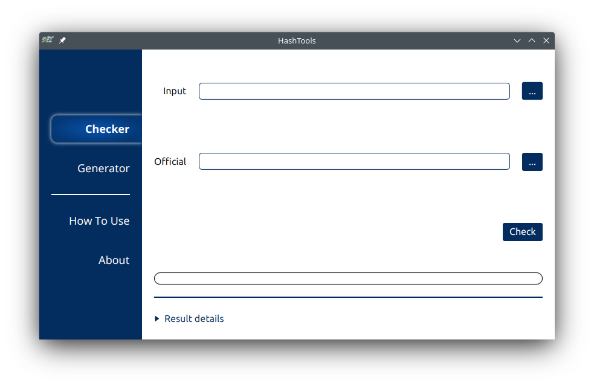

# HashTools

---

This application is used to work with hash checksums. These checksums are used to ensure that data has not been corrupted or tampered with. It works like a fingerprint, which changes with each modification made.

This tool makes it possible to check and generate hash checksums for both text and files. It can be run either with a graphical interface or from the command line.

This program has been fully updated to Java 17, thus eliminating the need to have the Java Runtime Environment installed on the machine, but this port made the program lose support for MacOS, since the developer does not have access to this operating system to generate the program's execution image.

This project is the successor to the [HashChecker](https://github.com/AdrianoSiqueira/HashChecker).

### How to use

This application does not need to be installed. Just [download](https://github.com/AdrianoSiqueira/HashTools/releases) the package corresponding to the operating system, unzip it somewhere and run the **launcher** inside the **_bin_** folder.

### Highlights:

- Multiple language support (automatically detected).
- Parallel processing support. Improved performance on multi-core processors.
- Small help content available locally, with easy access to the online manual.
- Support for dragging files and texts.

### Supported languages

- English (default if not match system).
- Portuguese.

### Information

[ Manual](https://github.com/AdrianoSiqueira/HashTools/wiki)

[ Download](https://github.com/AdrianoSiqueira/HashTools/releases)
